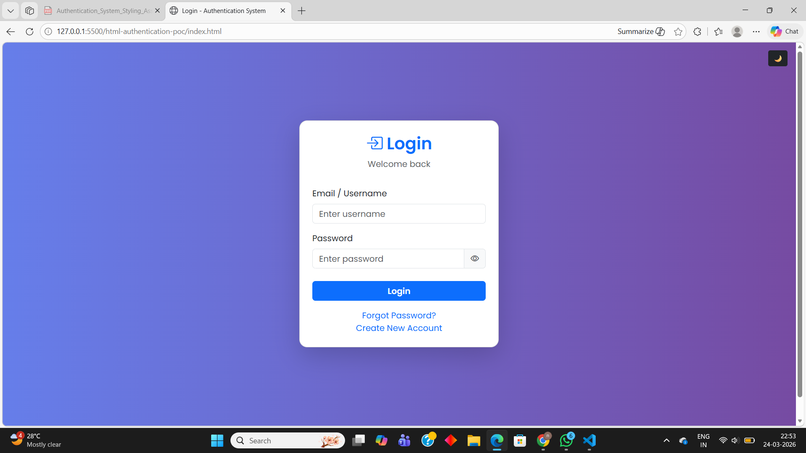
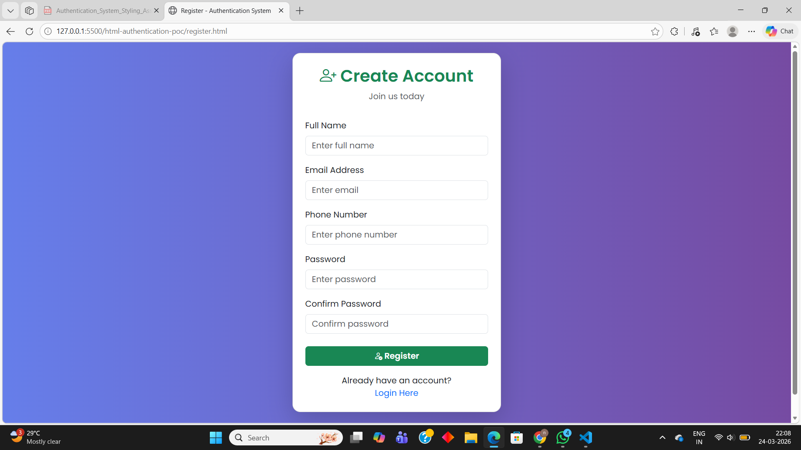
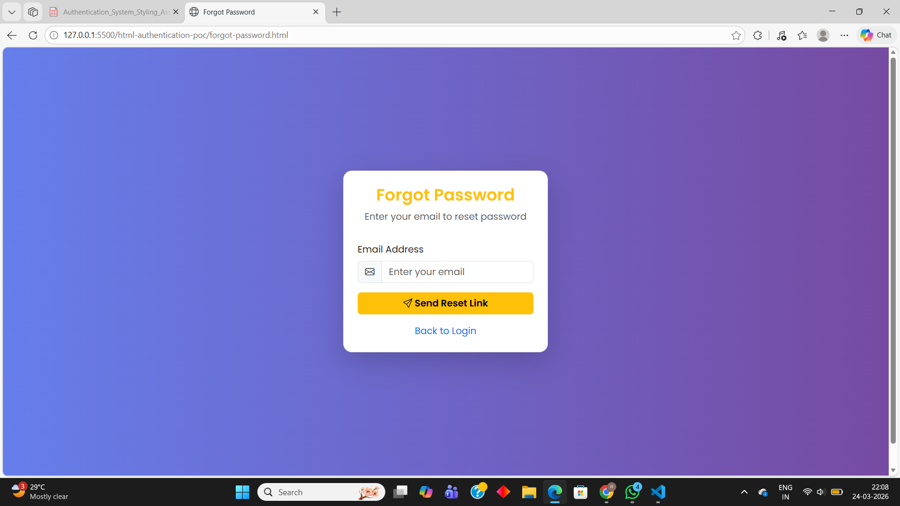
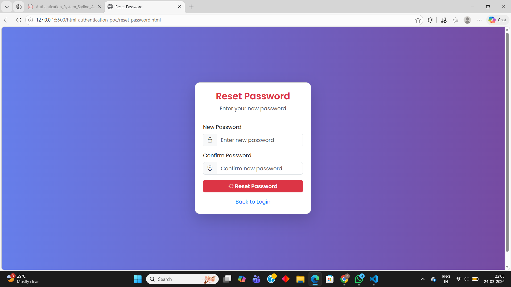
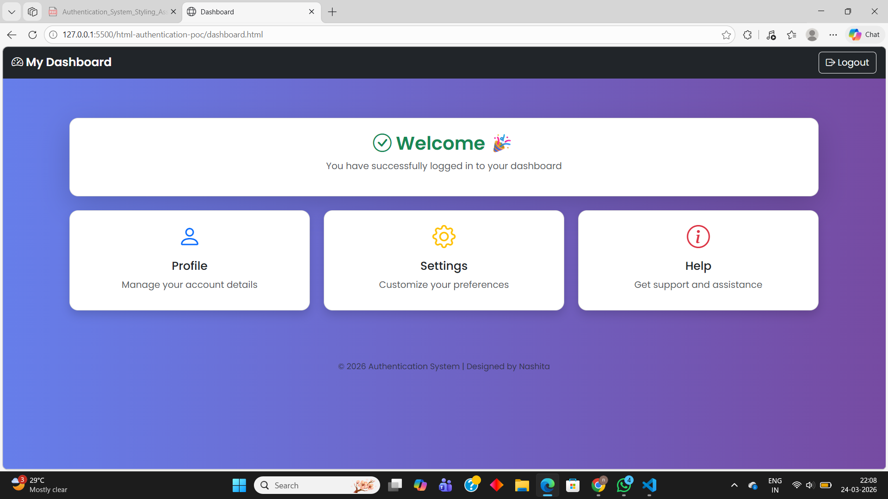

# 🌐 Authentication System (Advanced Bootstrap Version)

## 📌 Project Overview
This project is a fully responsive **Authentication System UI** built using **HTML5, Bootstrap 5, and Custom CSS**.  
It simulates a real-world authentication flow including login, registration, password recovery, and dashboard access.

The project has been enhanced with **modern UI features, animations, and interactive elements** to provide a professional user experience.

---

## 🚀 Features

### 🔐 Core Features
- Login Page  
- Registration Page  
- Forgot Password Page  
- Reset Password Page  
- Dashboard Page  

### 🎨 UI & Design Features
- Bootstrap 5 card-based layout  
- Responsive design for all devices  
- Bootstrap Icons integration  
- Clean and modern interface  

### ⚡ Advanced Features (Bonus)
- 👁️ Show/Hide Password toggle  
- 🔒 Password Strength Indicator  
- ⏳ Loading Spinner on button click  
- 🌙 Dark Mode Toggle (Light/Dark theme switch)  
- 🎬 Smooth Animations (fade & slide effects)  
- ✅ Custom form validation messages  

---

## 🛠️ Technologies Used
- HTML5  
- Bootstrap 5  
- Bootstrap Icons  
- Custom CSS  
- Basic JavaScript (for interactivity)

---

## 📱 Responsive Design
The application is fully responsive and works on:

- 📱 Mobile (320px+)  
- 📲 Tablet (768px+)  
- 💻 Laptop (1366px+)  
- 🖥️ Desktop (1920px+)  

---

## 🔗 Application Flow
- Login → Dashboard  
- Register → Login  
- Forgot Password → Reset Password → Login  
- Dashboard → Logout → Login  

---

## 🎬 UI Enhancements
- Smooth page transitions  
- Card animations on load  
- Hover effects on buttons and links  
- Gradient background styling  
- Dark mode for better user experience  

---

## 📂 Project Structure
authentication-system-styled/
│── index.html
│── register.html
│── forgot-password.html
│── reset-password.html
│── dashboard.html
│── styles.css
│── README.md
│
└── screenshots/
│── login.png
│── register.png
│── forgot-password.png
│── reset-password.png
│── dashboard.png

---

---

## 📸 Screenshots

### 🔐 Login Page

### 📝 Registration Page

### 🔑 Forgot Password Page

### 🔁 Reset Password Page

### 📊 Dashboard Page

---

## 💡 Key Learning Outcomes
- Understanding authentication flow UI  
- Working with Bootstrap components and grid system  
- Creating responsive web applications  
- Implementing custom styling and animations  
- Adding interactive features using JavaScript  

---

## ⚠️ Note
This project is a **frontend-only prototype**.  
No backend or database is connected.  
All navigation is handled using HTML anchor tags.

---

## 🔗 GitHub Repository
https://github.com/nashitagazi-commits/html-authentication-poc

---

## 👩‍💻 Author
**Nashita Gazi**  
Developed as part of internship assignment.

---

## ⭐ Conclusion
This project demonstrates a **complete authentication UI system** with modern design, responsiveness, and interactive features.  
It reflects best practices in frontend development and user interface design.